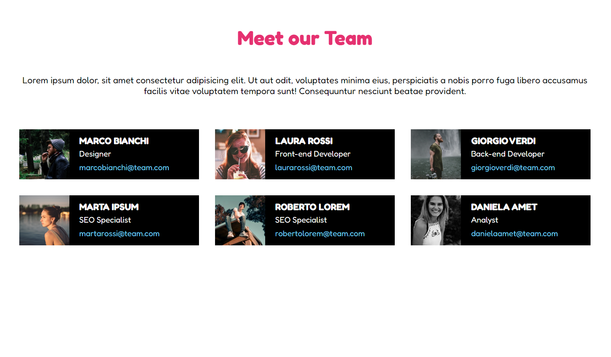

# Our Team

## Descrizione

Dato un array di oggetti (già fornito all'interno di un file .js) rappresentare un team di un’azienda, creare una pagina dedicata in cui mostrare una card per ciascun componente.

## Bonus

- Rendere l’esercizio responsive, mandando a capo le card.
- Aggiungere un form di aggiunta membri che permetta di visualizzare il nuovo membro sulla pagina.

### Immagine del layout

   